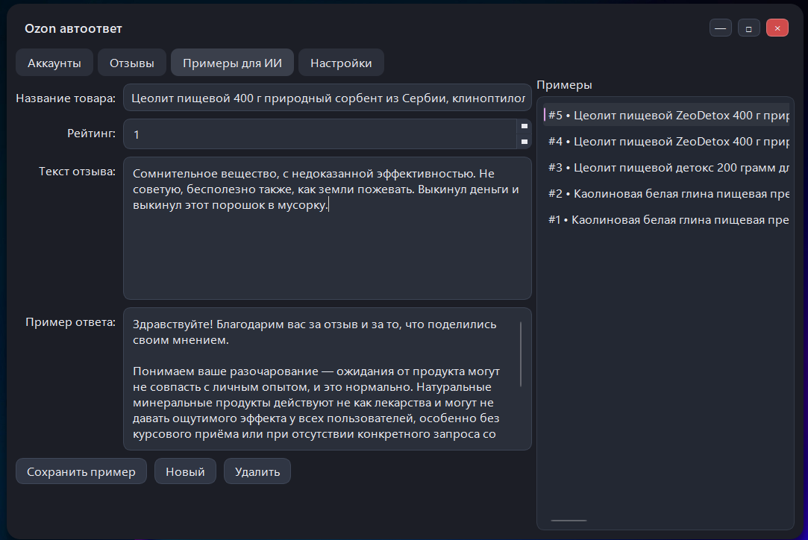

# OzonAutoReply
[English](#english)

OzonAutoReply — десктопное приложение для селлеров Ozon (PyQt6): загружает новые отзывы, генерирует ответы через OpenAI и (опционально) автоматически публикует их. Хранение в SQLite, управление аккаунтами/шаблонами/настройками, сборка в .exe через PyInstaller.

## Стек
- Python 3
- PyQt6 (GUI)
- Playwright (загрузка отзывов из кабинета Ozon)
- OpenAI API (генерация ответов)
- SQLite (локальное хранилище)
- PyInstaller (сборка в exe)

## Запуск
1. Создайте и активируйте виртуальное окружение.
2. Установите зависимости.
3. Установите браузер для Playwright.
4. Запустите приложение.

```powershell
python -m venv venv
.\venv\Scripts\activate
pip install -r requirements.txt
python -m playwright install chromium
python app.py
```

## Сборка (опционально)
```powershell
pip install pyinstaller
$env:PLAYWRIGHT_BROWSERS_PATH = "$PWD\playwright-browsers"
python -m playwright install chromium
python -m PyInstaller --noconfirm --windowed --name OzonAutoReply ^
  --add-data "ozon_ai.db;." ^
  --add-data "ozon_ai\data;ozon_ai\data" ^
  --add-data "playwright-browsers;playwright-browsers" ^
  --collect-all playwright ^
  --collect-all playwright_stealth ^
  --hidden-import ozon_ai.playwright_runner ^
  app.py
```

Готовый файл: `dist\OzonAutoReply\OzonAutoReply.exe`

---

# English

OzonAutoReply is a desktop app for Ozon sellers (PyQt6): it loads new reviews, generates replies via OpenAI, and optionally auto-posts them. Data is stored in SQLite; accounts/templates/settings are managed in the UI; builds into a Windows .exe with PyInstaller.

## Stack
- Python 3
- PyQt6 (GUI)
- Playwright (fetching reviews from Ozon seller кабинет)
- OpenAI API (reply generation)
- SQLite (local storage)
- PyInstaller (exe build)

## Run
1. Create and activate a virtual environment.
2. Install dependencies.
3. Install the Playwright browser.
4. Start the app.

```powershell
python -m venv venv
.\venv\Scripts\activate
pip install -r requirements.txt
python -m playwright install chromium
python app.py
```

## Build (optional)
```powershell
pip install pyinstaller
$env:PLAYWRIGHT_BROWSERS_PATH = "$PWD\playwright-browsers"
python -m playwright install chromium
python -m PyInstaller --noconfirm --windowed --name OzonAutoReply ^
  --add-data "ozon_ai.db;." ^
  --add-data "ozon_ai\data;ozon_ai\data" ^
  --add-data "playwright-browsers;playwright-browsers" ^
  --collect-all playwright ^
  --collect-all playwright_stealth ^
  --hidden-import ozon_ai.playwright_runner ^
  app.py
```

Output: `dist\OzonAutoReply\OzonAutoReply.exe`
