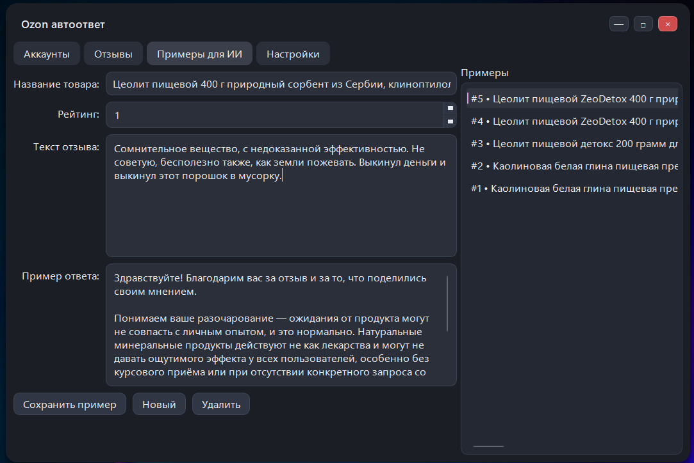

# OzonAutoReply
[English](#english)

OzonAutoReply — десктопное приложение для селлеров Ozon (PyQt6): загружает новые отзывы, генерирует ответы через OpenAI и (опционально) автоматически публикует их. Хранение в SQLite, управление аккаунтами/шаблонами/настройками, сборка в .exe через PyInstaller.

## Стек
- Python 3
- PyQt6 (GUI)
- Playwright (загрузка отзывов из кабинета Ozon)
- OpenAI API (генерация ответов)
- SQLite (локальное хранилище)
- PyInstaller (сборка в exe)

## Запуск
1. Создайте и активируйте виртуальное окружение.
2. Установите зависимости.
3. Установите браузер для Playwright.
4. Запустите приложение.

```powershell
python -m venv venv
.\venv\Scripts\activate
pip install -r requirements.txt
python -m playwright install chromium
python app.py
```

## Прокси
В настройках приложения можно включить общий прокси для всех сетевых операций:
- вход в Ozon через Playwright;
- загрузка отзывов из Ozon;
- отправка ответов на отзывы;
- генерация ответов через OpenAI.

Поддерживаются типы `HTTP`, `HTTPS` и `SOCKS5`, а также логин/пароль. Если прокси включен, обязательно заполните хост и порт.

## Сборка (опционально)
```powershell
pip install pyinstaller
$env:PLAYWRIGHT_BROWSERS_PATH = "$PWD\playwright-browsers"
python -m playwright install chromium
python -m PyInstaller --noconfirm --windowed --name OzonAutoReply ^
  --add-data "ozon_ai.db;." ^
  --add-data "ozon_ai\data;ozon_ai\data" ^
  --add-data "playwright-browsers;playwright-browsers" ^
  --collect-all playwright ^
  --collect-all playwright_stealth ^
  --hidden-import ozon_ai.playwright_runner ^
  app.py
```

Готовый файл: `dist\OzonAutoReply\OzonAutoReply.exe`

Сборка создается в формате `one-dir`, поэтому на другой ПК/сервер нужно копировать всю папку `dist\OzonAutoReply`, а не только один `OzonAutoReply.exe`.

## Импорт сессии из реального браузера
Если Ozon блокирует встроенный Playwright-логин, но открывается в обычном Chrome/Edge на сервере через рабочий прокси, можно войти в Ozon в реальном браузере и импортировать сессию в приложение.

Важно:
- прокси в настройках приложения лучше оставить включенным, если через него затем должны идти загрузка отзывов и отправка ответов;
- для импорта нужен Chrome или Edge на том же сервере;
- перед импортом в этом браузере нужно открыть `https://seller.ozon.ru/app/reviews`.

Шаги:
1. Скопируйте на сервер всю папку сборки `dist\OzonAutoReply`.
2. Откройте PowerShell в папке приложения.
3. Посмотрите список аккаунтов в базе:

```powershell
.\OzonAutoReply.exe --list-accounts
```

4. Откройте реальный браузер без Playwright-автоматизации:

```powershell
.\OzonAutoReply.exe --open-real-browser
```

5. В открывшемся Chrome/Edge:
- войдите в Ozon;
- откройте `https://seller.ozon.ru/app/reviews`;
- не закрывайте это окно браузера.

6. Импортируйте сессию в существующий аккаунт:

```powershell
.\OzonAutoReply.exe --import-session-from-browser --account-id 3
```

Или создайте новый аккаунт:

```powershell
.\OzonAutoReply.exe --import-session-from-browser --name "Ozon Server"
```

7. После успешного импорта запустите приложение обычным способом:

```powershell
.\OzonAutoReply.exe
```

Если после импорта приложение пишет, что сессия неполная или требует повторного входа, убедитесь, что в том же браузере действительно открыта страница `seller.ozon.ru/app/reviews`, и повторите импорт.

---

# English

OzonAutoReply is a desktop app for Ozon sellers (PyQt6): it loads new reviews, generates replies via OpenAI, and optionally auto-posts them. Data is stored in SQLite; accounts/templates/settings are managed in the UI; builds into a Windows .exe with PyInstaller.

## Stack
- Python 3
- PyQt6 (GUI)
- Playwright (fetching reviews from Ozon seller кабинет)
- OpenAI API (reply generation)
- SQLite (local storage)
- PyInstaller (exe build)

## Run
1. Create and activate a virtual environment.
2. Install dependencies.
3. Install the Playwright browser.
4. Start the app.

```powershell
python -m venv venv
.\venv\Scripts\activate
pip install -r requirements.txt
python -m playwright install chromium
python app.py
```

## Proxy
The Settings tab can enable one shared proxy for all network operations:
- Ozon login through Playwright;
- fetching Ozon reviews;
- posting review replies;
- generating replies through OpenAI.

Supported proxy types are `HTTP`, `HTTPS`, and `SOCKS5`, with optional username/password authentication. Host and port are required when the proxy is enabled.

## Build (optional)
```powershell
pip install pyinstaller
$env:PLAYWRIGHT_BROWSERS_PATH = "$PWD\playwright-browsers"
python -m playwright install chromium
python -m PyInstaller --noconfirm --windowed --name OzonAutoReply ^
  --add-data "ozon_ai.db;." ^
  --add-data "ozon_ai\data;ozon_ai\data" ^
  --add-data "playwright-browsers;playwright-browsers" ^
  --collect-all playwright ^
  --collect-all playwright_stealth ^
  --hidden-import ozon_ai.playwright_runner ^
  app.py
```

Output: `dist\OzonAutoReply\OzonAutoReply.exe`

The build is `one-dir`, so copy the whole `dist\OzonAutoReply` folder to another PC/server, not just `OzonAutoReply.exe`.

## Import Session From A Real Browser
If Ozon blocks the built-in Playwright login, but opens in a normal Chrome/Edge window on the server through a working proxy, you can sign in using a real browser and import that session into the app.

Important:
- keep the app proxy enabled if review fetching and comment posting should continue through that proxy;
- Chrome or Edge must be installed on the same server;
- before importing, open `https://seller.ozon.ru/app/reviews` in that browser.

Steps:
1. Copy the whole `dist\OzonAutoReply` build folder to the server.
2. Open PowerShell in the app folder.
3. List account ids from the local DB:

```powershell
.\OzonAutoReply.exe --list-accounts
```

4. Open a real browser without Playwright automation:

```powershell
.\OzonAutoReply.exe --open-real-browser
```

5. In the opened Chrome/Edge window:
- sign in to Ozon;
- open `https://seller.ozon.ru/app/reviews`;
- keep that browser window open.

6. Import the session into an existing account:

```powershell
.\OzonAutoReply.exe --import-session-from-browser --account-id 3
```

Or create a new account:

```powershell
.\OzonAutoReply.exe --import-session-from-browser --name "Ozon Server"
```

7. After a successful import, run the app normally:

```powershell
.\OzonAutoReply.exe
```

If the app reports that the session is incomplete or needs relogin, make sure `seller.ozon.ru/app/reviews` is open in that same browser window and repeat the import.
